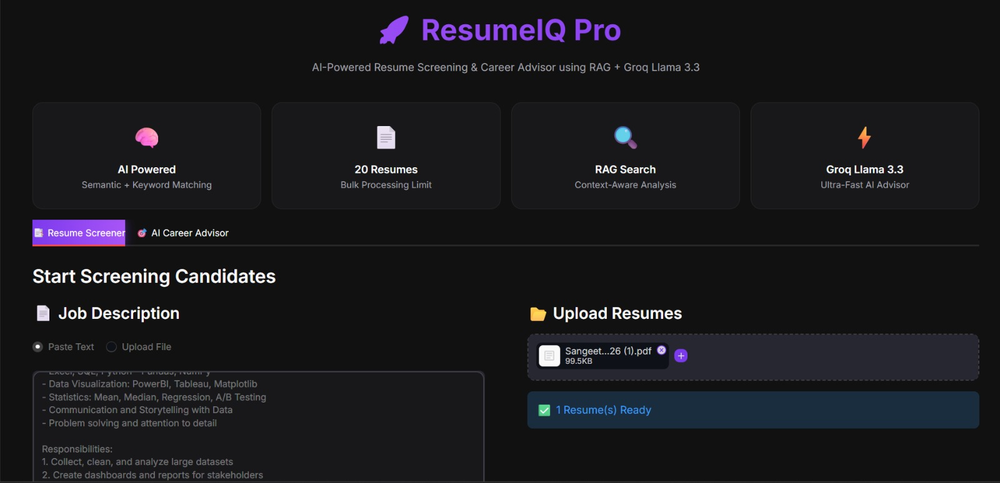
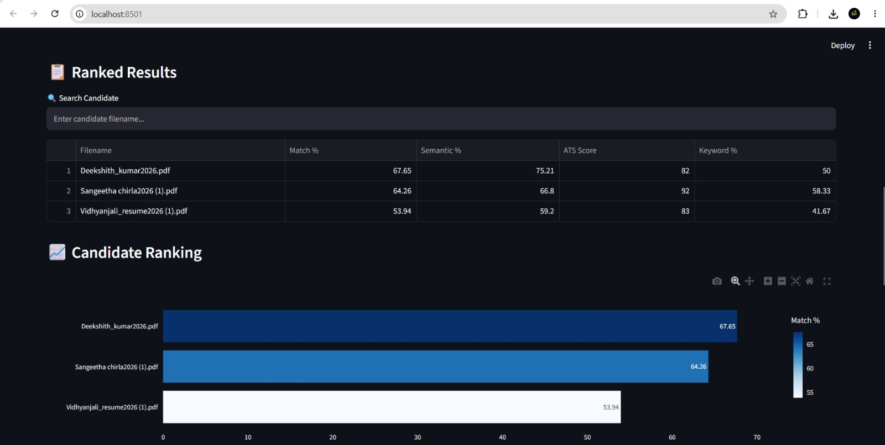

# 🚀 ResumeIQ Pro

> AI-Powered Resume Screening & Career Advisor using Retrieval-Augmented Generation (RAG) and Groq Llama 3.3


---

## 📌 Project Overview

ResumeIQ Pro is an AI-powered Resume Screening System that helps recruiters identify the most suitable candidates by comparing resumes with a Job Description using Semantic Search and Retrieval-Augmented Generation (RAG).

Unlike traditional ATS systems that rely only on keyword matching, ResumeIQ Pro combines semantic similarity, keyword analysis, ATS scoring, and AI-powered career guidance to generate accurate and explainable candidate evaluations.

The system also provides personalized career advice, interview questions, skill gap analysis, and resume improvement suggestions using Groq Llama 3.3.

---

## ✨ Features

- 📄 Resume Parsing (PDF & DOCX)
- 🧠 Semantic Search using Sentence Transformers
- 🔍 FAISS Vector Search
- 📊 ATS Score Calculation
- ✅ Skill Matching & Missing Skills Detection
- 📈 Resume Ranking Dashboard
- 🤖 AI Career Advisor
- 🎯 Skill Gap Analysis
- 💼 AI Interview Questions
- 📝 Resume Improvement Suggestions
- 📥 CSV Export
- 🌙 Professional Dark UI
---

# 🛠️ Technology Stack

| Category | Technologies |
|----------|--------------|
| Programming Language | Python 3.12 |
| Frontend | Streamlit |
| AI Model | Groq Llama 3.3 |
| Embedding Model | Sentence Transformers (all-MiniLM-L6-v2) |
| Vector Database | FAISS |
| Data Processing | Pandas |
| Visualization | Plotly |
| Document Parsing | PyMuPDF, python-docx |
| Machine Learning | Sentence Transformers |
| Environment | Python Virtual Environment |

---

# 🏗️ System Architecture

```
                +------------------------+
                |  Job Description (JD)  |
                +-----------+------------+
                            |
                            |
                    Text Preprocessing
                            |
                            |
                    Sentence Embedding
                            |
                            |
         +------------------+------------------+
         |                                     |
         |                                     |
 Resume Parsing                      Resume Embeddings
 (PDF / DOCX)                               |
         |                                  |
         +------------------+---------------+
                            |
                      FAISS Vector Search
                            |
                    Semantic Similarity
                            |
          ATS Score + Skill Matching Engine
                            |
                 Candidate Ranking Dashboard
                            |
                AI Career Advisor (Groq)
                            |
        Gap Analysis • Interview Questions
          Resume Suggestions • Skill Report
```

---

# 📂 Project Structure

```
ResumeIQ-RAG/
│
├── app/
│   └── streamlit_app.py
│
├── src/
│   ├── parser.py
│   ├── preprocess.py
│   ├── embeddings.py
│   ├── vector_index.py
│   ├── scoring.py
│   ├── ats_score.py
│   ├── rag_assistant.py
│   └── skills_data.py
│
├── data/
│   └── sample_resumes/
│
├── assets/
│
├── requirements.txt
│
├── README.md
│
└── .env.example
```

---

# ⚙️ How It Works

1. Upload a Job Description.
2. Upload one or more resumes.
3. ResumeIQ extracts text from each resume.
4. Text is cleaned and converted into embeddings.
5. FAISS performs semantic similarity search.
6. ATS score and keyword matching are calculated.
7. Candidates are ranked based on their final score.
8. Groq Llama 3.3 generates:
   - Skill Gap Analysis
   - Interview Questions
   - Resume Improvement Suggestions
9. Users can download the results as a CSV report.

---

# 📸 Application Screenshots

> Replace these placeholders with screenshots of your application after deployment.

### 🏠 Home Page



---

### 📊 Resume Screening Dashboard



---

### 🤖 AI Career Advisor


---

# 🚀 Installation

## 1. Clone the Repository

```bash
git clone https://github.com/sangeethareddy9/ResumeIQ-RAG.git
```

## 2. Navigate to Project Folder

```bash
cd ResumeIQ-RAG
```

## 3. Create Virtual Environment

### Windows

```bash
python -m venv venv
venv\Scripts\activate
```

### Linux / macOS

```bash
python3 -m venv venv
source venv/bin/activate
```

---

## 4. Install Dependencies

```bash
pip install -r requirements.txt
```

---

## 5. Configure Environment Variables

Create a file named **.env**

```
GROQ_API_KEY=your_groq_api_key
```

---

## 6. Run the Application

```bash
streamlit run app/streamlit_app.py
```

---

# 🎯 Future Enhancements

- Resume PDF Report Generation
- Recruiter Login Dashboard
- Multi Job Description Comparison
- Email Notification System
- Interview Scheduling
- Candidate Recommendation Engine
- Cloud Database Integration
- Authentication & User Management
- Resume Version Tracking
- AI Resume Rewrite Assistant

---

# 👨‍💻 Author

**Sangeetha Chirla**

Python Full Stack Developer

📧 Email: *chirlasangeetha@gmail.com*

🔗 GitHub: https://github.com/sangeethareddy9

💼 LinkedIn: *https://www.linkedin.com/in/chirla-naga-sangeetha/*

---

# 📜 License

This project is developed for educational and learning purposes.

---

# ⭐ Support

If you found this project helpful, consider giving it a ⭐ on GitHub.

---

<p align="center">
<b>ResumeIQ Pro</b><br>

AI Resume Screening using RAG + FAISS + Groq Llama 3.3

Made with ❤️ using Python, Streamlit and Generative AI
</p>
