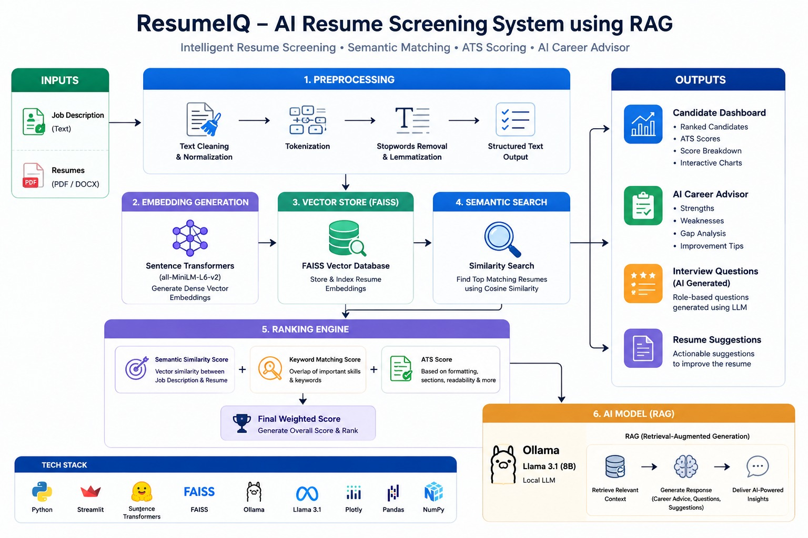
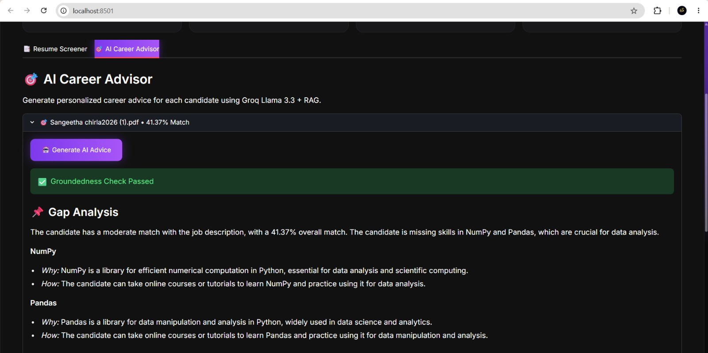

# 🚀 ResumeIQ-RAG

> **AI-Powered Resume Screening & Career Advisor using Retrieval-Augmented Generation (RAG) and Groq Llama 3.3**


---

# 📌 Project Overview

ResumeIQ-RAG is an AI-powered Resume Screening and Career Advisor application that helps recruiters efficiently identify the most suitable candidates by comparing resumes with a Job Description (JD) using Retrieval-Augmented Generation (RAG).

Unlike traditional Applicant Tracking Systems (ATS) that rely only on keyword matching, ResumeIQ-RAG combines semantic similarity, ATS scoring, skill extraction, and Retrieval-Augmented Generation (RAG) to deliver accurate, explainable, and intelligent candidate evaluations.

The application also provides AI-generated career guidance, skill gap analysis, interview preparation, and resume improvement suggestions using **Groq Llama 3.3**.

---

# 🌐 Live Demo

### 🚀 Streamlit Application

https://resumeiq-rag-ccwyjsr4wdbhw5xed74ecv.streamlit.app/

---

# ✨ Features

- ✅ Resume Parsing (PDF & DOCX)
- ✅ Semantic Resume Matching
- ✅ ATS Score Calculation
- ✅ Skill Extraction
- ✅ Missing Skill Detection
- ✅ FAISS Vector Search
- ✅ Resume Ranking Dashboard
- ✅ AI Career Advisor
- ✅ Skill Gap Analysis
- ✅ AI Interview Question Generation
- ✅ Resume Improvement Suggestions
- ✅ CSV Export
- ✅ Professional Dark-Themed UI

---

# 🛠️ Technology Stack

| Category | Technology |
|------------|-------------------------------|
| Programming Language | Python 3.12 |
| Frontend | Streamlit |
| AI Model | Groq Llama 3.3 |
| Embedding Model | Sentence Transformers (all-MiniLM-L6-v2) |
| Vector Database | FAISS |
| Machine Learning | Sentence Transformers |
| Data Processing | Pandas |
| Visualization | Plotly |
| Document Parsing | PyMuPDF, python-docx |
| Environment | Python Virtual Environment |

---

# 🏗️ System Architecture



**Figure:** Overall workflow of ResumeIQ-RAG showing Resume Parsing, Embedding Generation, FAISS Retrieval, ATS Scoring, Candidate Ranking, and AI Career Advisor.

---

# ⚙️ Project Workflow

1. Upload a Job Description (JD).
2. Upload one or more resumes.
3. ResumeIQ extracts text from PDF/DOCX files.
4. Text is cleaned and preprocessed.
5. Sentence embeddings are generated.
6. Resume embeddings are stored in FAISS.
7. Semantic similarity between resumes and the JD is calculated.
8. ATS score and keyword matching are computed.
9. Candidates are ranked based on the final score.
10. Groq Llama 3.3 generates:
    - Skill Gap Analysis
    - Resume Improvement Suggestions
    - Interview Questions
    - Career Guidance
11. Results can be exported as a CSV report.

---

# 📂 Project Structure

```text
ResumeIQ-RAG/
│
├── app/
│   └── streamlit_app.py
│
├── src/
│   ├── parser.py
│   ├── preprocess.py
│   ├── embeddings.py
│   ├── vector_index.py
│   ├── scoring.py
│   ├── ats_score.py
│   ├── rag_assistant.py
│   └── skills_data.py
│
├── assets/
│   ├── home.png
│   ├── dashboard.png
│   ├── advisor.png
│   └── architecture.png
│
├── data/
│   └── sample_resumes/
│
├── requirements.txt
├── README.md
└── .env.example
```

---

# 📸 Application Screenshots

## 🏠 Home Page


**Figure 1:** Landing page of ResumeIQ-RAG displaying the Resume Screening and AI Career Advisor modules.

---

## 📊 Resume Screening Dashboard


**Figure 2:** Dashboard showing ATS score, semantic similarity, matched skills, ranking, and resume evaluation.

---

## 🤖 AI Career Advisor



**Figure 3:** AI Career Advisor powered by Groq Llama 3.3 providing personalized career guidance, interview questions, and resume improvement suggestions.

---

# 🚀 Installation

## 1. Clone the Repository

```bash
git clone https://github.com/sangeethareddy9/ResumeIQ-RAG.git
```

## 2. Navigate to the Project Directory

```bash
cd ResumeIQ-RAG
```

## 3. Create a Virtual Environment

### Windows

```bash
python -m venv venv
venv\Scripts\activate
```

### Linux / macOS

```bash
python3 -m venv venv
source venv/bin/activate
```

---

## 4. Install Dependencies

```bash
pip install -r requirements.txt
```

---

## 5. Configure Environment Variables

Create a file named **.env**

```env
GROQ_API_KEY=your_groq_api_key
```

---

## 6. Run the Application

```bash
streamlit run app/streamlit_app.py
```

---

# 🎯 Future Enhancements

- Resume PDF Report Generation
- Recruiter Login Dashboard
- Candidate Recommendation Engine
- Resume Version Tracking
- AI Resume Rewrite Assistant
- Multi-Job Description Comparison
- Email Notification System
- Interview Scheduling
- Authentication & User Management
- Cloud Database Integration

---

# 👥 Project Team

| Name | Student ID |
|--------|-------------|
| Chirla Naga Sangeetha | CGVI0021 |
| Mannepalli Deekshith Kumar | CGVI0030 |
| Gundubogula Vidhyanjali | CGVI0015 |

---

# 👨‍💻 Developed By

**Team ResumeIQ-RAG**

- Chirla Naga Sangeetha
- Mannepalli Deekshith Kumar
- Gundubogula Vidhyanjali

---

# 📧 Contact

**Email:** chirlasangeetha@gmail.com

**GitHub:** https://github.com/sangeethareddy9

**LinkedIn:** https://www.linkedin.com/in/chirla-naga-sangeetha/

---

# 📜 License

This project was developed for educational and academic purposes as part of the **Codegnan Generative AI Module**.

---

# ⭐ Support

If you found this project useful, please consider giving it a ⭐ on GitHub.

---

<p align="center">
<b>ResumeIQ-RAG</b><br><br>

AI-Powered Resume Screening & Career Advisor using RAG, FAISS and Groq Llama 3.3

<br><br>

Made with ❤️ using Python, Streamlit and Generative AI

</p>
