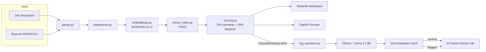

# AI Resume Screener

> Upload a job description and multiple resumes — get each one ranked by semantic match score with a clear explanation of *why*, plus AI-generated interview questions, gap analysis, and resume rewrite suggestions grounded in the actual match evidence.

<!-- Replace this line with your demo GIF once recorded -->
<!--  -->

[](https://www.python.org/)
[](https://streamlit.io/)
[](https://fastapi.tiangolo.com/)
[](https://www.sbert.net/)
[](https://ollama.com/)

## The problem

Keyword-matching resume scanners miss good candidates who describe their experience differently than the job posting does. A resume that says *"built scalable APIs"* should match a JD asking for *"REST API development"* — but a literal keyword scanner won't see the connection. This tool uses sentence embeddings to compare resumes and job descriptions on **meaning**, not just shared words, while still surfacing concrete matched/missing skills so the score is explainable, not a black box.

## How it works

1. **Parse** — extracts raw text from uploaded PDF/DOCX resumes and job descriptions
2. **Clean** — normalizes whitespace and formatting noise with spaCy
3. **Embed** — converts JD and resume text into dense vectors using `all-MiniLM-L6-v2` (sentence-transformers)
4. **Index & search** — stores resume embeddings in a FAISS vector index, queries it with the JD embedding for fast cosine-similarity ranking
5. **Explain** — extracts skill keywords from both JD and resume text, reports matched vs. missing skills
6. **Score** — combines semantic similarity (70%) and keyword overlap (30%) into one final match score
7. **Display** — ranked table, Plotly bar chart, expandable per-candidate breakdown, CSV export

## AI Career Advisor (RAG layer)

Once a candidate is scored, the **AI Career Advisor** tab turns that score into something actionable: a gap analysis, a set of interview questions, and specific resume rewrite suggestions — generated by a locally-running LLM (`Llama 3.1 8B` via [Ollama](https://ollama.com/)) and grounded in the exact matched/missing skill evidence the scoring engine already produced.

**Why retrieval-augmented, not just "ask the LLM about this resume":** an LLM prompted with only a resume and a JD will happily invent plausible-sounding skill gaps that aren't real, because it's reasoning from general knowledge about the role rather than the actual document in front of it. This tool instead retrieves the specific matched/missing skill lists that `scoring.py` already computed via semantic similarity + keyword matching, and hands *only that evidence* to the LLM as grounding context — the model is instructed to reason over retrieved facts, not invent new ones.

**Why a local open-source model instead of the OpenAI API:**
- **No per-request cost** — this runs entirely offline, so screening a batch of candidates doesn't scale API spend with usage.
- **No resume data leaves the machine** — resumes are sensitive personal documents; sending them to a third-party API is a real privacy tradeoff a local model avoids entirely.
- **A genuinely useful skill to demonstrate** — building an LLM feature that doesn't depend on a hosted provider's API key shows the underlying RAG architecture (retrieval, prompting, structured output, hallucination guardrails) actually works on its own merits, not just because a frontier model papered over weak grounding.

The tradeoff is real and worth naming: a local 8B model is less capable than GPT-4-class models, and outputs need explicit guardrails (see below) to stay trustworthy. That tradeoff is the point — it's what makes the groundedness check necessary rather than decorative.

### Groundedness check — the actual differentiator

Every response the LLM generates is checked against the evidence it was given. Specifically, every skill named in a `missing_skill_gaps` entry or as an interview question's `related_skill` is verified against the `matched_skills`/`missing_skills` lists retrieved from `scoring.py` — the exact same evidence the model was prompted with. Any skill mentioned that isn't in that verified set gets flagged, not silently trusted.

This isn't a hypothetical safeguard — it caught a real borderline case during testing. Scoring a resume against a JD that asked for `PostgreSQL` (not `SQL`), the model generated an interview question tagged `related_skill: "SQL"` — a reasonable-sounding inference, but not something the JD or scoring engine actually asked for. The groundedness check flagged it automatically:

```json
{"is_grounded": false, "unverified_skills": ["SQL"]}
```

The Streamlit UI surfaces this directly — a green "groundedness check passed" banner, or a yellow warning naming exactly which claim wasn't verified — so the check doesn't just run silently in a log somewhere, it's visible to whoever's using the tool.

## Tech stack

| Layer | Tools |
|---|---|
| Core ML/NLP | `sentence-transformers`, `FAISS`, `spaCy`, `scikit-learn` |
| RAG / LLM | `Ollama` (Llama 3.1 8B, local), custom grounding + groundedness-check layer |
| Backend | `FastAPI`, `PyMuPDF`, `python-docx`, `pydantic` |
| Frontend | `Streamlit`, `Plotly`, `pandas` |
| Deployment | Hugging Face Spaces |

## Architecture

The scoring engine (`src/`) is fully decoupled from the interface layer (`app/`). Both the Streamlit dashboard and the FastAPI REST API call the same underlying parsing, embedding, and scoring logic — so the core engine has exactly one implementation, tested once, used by two different clients.

```
src/
  models.py       — shared data schemas
  parser.py       — PDF/DOCX text extraction
  preprocess.py   — text cleaning
  embeddings.py   — sentence-transformer embeddings + cosine similarity
  skills_data.py  — skill vocabulary + keyword extraction
  vector_index.py — FAISS index build/search
  scoring.py      — weighted semantic + keyword scoring
  rag_assistant.py — RAG grounding layer, LLM prompt/generation, groundedness check

app/
  streamlit_app.py — interactive dashboard (Resume Screener + AI Career Advisor tabs)
  fastapi_app.py   — REST API (POST /screen, POST /advise)
```

**Known limitation:** the resume-text cache that powers `POST /advise` (and the Streamlit advisor tab) is in-memory and process-local — it resets on server restart and isn't shared across multiple server processes. That's a deliberate simplification for a local single-user demo; a production version would back this with a real store (Redis, a database, or a session-scoped cache) instead.

## Running locally

```bash
git clone https://github.com/AtharvJawalkar08/resume-screener.git
cd resume-screener
python -m venv .venv
.venv\Scripts\Activate.ps1      # Windows
# source .venv/bin/activate     # macOS/Linux

pip install -r requirements.txt
python -m spacy download en_core_web_sm

streamlit run app/streamlit_app.py
```

To run the REST API instead:

```bash
uvicorn app.fastapi_app:app --reload --port 8000
# then visit http://127.0.0.1:8000/docs
```

### AI Career Advisor prerequisite: Ollama

The advisor tab/endpoint needs a local Ollama server running with the model pulled:

```bash
# 1. Install Ollama: https://ollama.com/download
# 2. Pull the model (one-time, ~4.9GB)
ollama pull llama3.1:8b
# 3. Start the server (leave this running in its own terminal)
ollama serve
```

With `ollama serve` running, the Streamlit advisor tab and the `/advise` endpoint will reach it at `http://127.0.0.1:11434` automatically. Without it, both fail gracefully with a clear "could not reach Ollama" error rather than crashing.

## What I learned

Building this taught me the practical difference between keyword matching and semantic similarity — and why neither alone is enough for something explainable. Pure embeddings give you a meaningful score but no way to justify it to a hiring manager; pure keyword matching is explainable but blind to paraphrasing. Combining both, weighted, gave a score that's both accurate and defensible.

I also separated the scoring engine from the interface early, which paid off when I added the FastAPI backend — the entire `/screen` endpoint reused the existing scoring code with zero duplication, since both the UI and the API call the same internal functions.

Adding the RAG layer reinforced the same lesson from a different angle: an LLM feature is only as trustworthy as its grounding. It's easy to get an LLM to *sound* confident about a candidate's skill gaps; it's a different problem to make sure every specific claim traces back to real, retrieved evidence rather than the model's own assumptions. Building the groundedness check as a separate, explicit verification step (rather than just trusting a well-written prompt) is what actually caught a real hallucinated skill mention during testing — a good reminder that "ask the model nicely not to hallucinate" isn't a substitute for checking its work.

## License

MIT
## Architecture



## Key metrics

| Metric | Value |
|---|---|
| Embedding model | `all-MiniLM-L6-v2` (384-dim) |
| Scoring weights | 70% semantic similarity, 30% keyword overlap |
| Groundedness check | Every LLM-generated skill claim verified against `scoring.py`'s matched/missing skill lists |
| Caught in testing | 1 unverified claim (`SQL` inferred from a `PostgreSQL` requirement) flagged automatically before reaching the user |

*(No formal precision/recall eval exists yet for the ranking itself — see below.)*

## What I'd improve with more time

- **Evaluate the ranking, not just the pipeline.** Right now there's no labeled dataset of "this resume should/shouldn't rank highly for this JD," so I can't report precision@k or measure whether the 70/30 semantic/keyword weighting is actually optimal versus arbitrary. I'd build a small labeled eval set and tune the weights against it.
- **Persist the resume-text cache.** The `/advise` endpoint's cache is in-memory and process-local by design (noted above) — swapping in Redis or a database would make this deployable as a real multi-user service instead of a single-session demo.
- **Expand the groundedness check beyond skills.** It currently verifies skill names but not, say, years-of-experience claims or seniority-level inferences the LLM might make in rewrite suggestions.
- **Add automated regression tests for the RAG layer.** `smoke_test_rag.py` exists but a real eval harness (e.g., a small set of JD/resume pairs with known-good gap analyses) would catch prompt-drift when the underlying model or prompt template changes.
