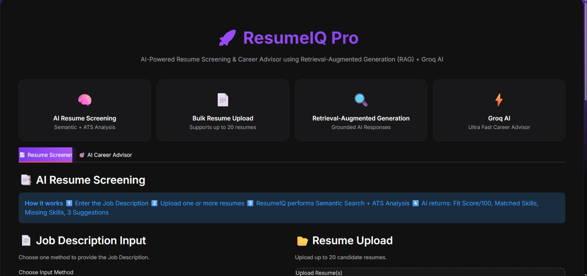
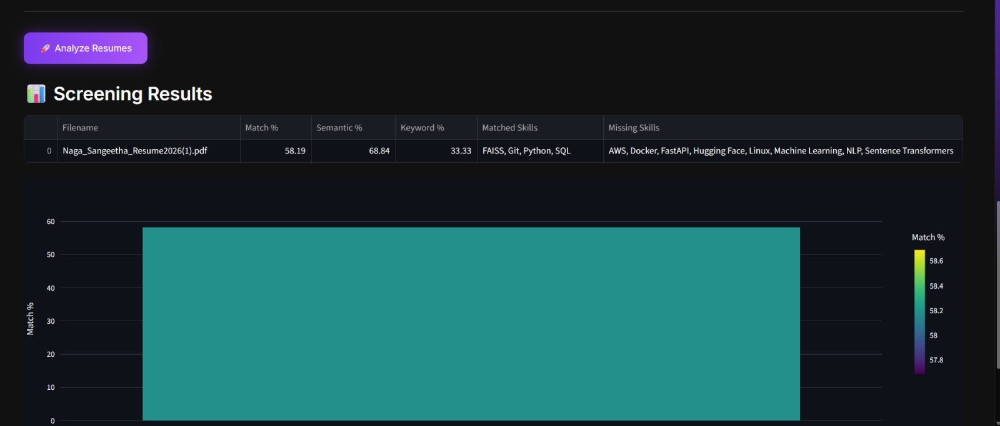
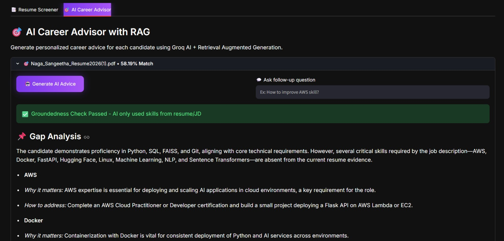
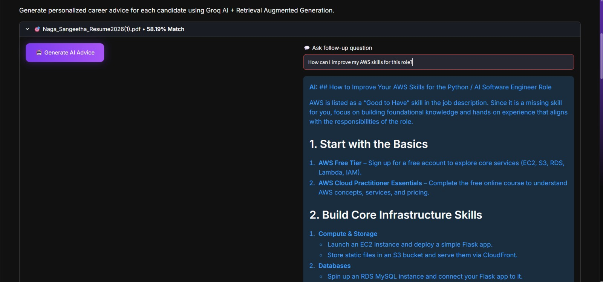
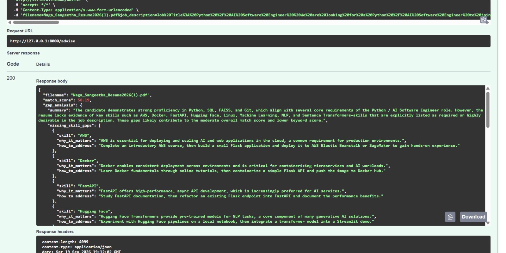

# 🚀 ResumeIQ Pro

> AI-Powered Resume Screening & Career Advisor using Retrieval-Augmented Generation (RAG), FAISS, Sentence Transformers, FastAPI, Streamlit, and Groq API.


---

## 📌 Project Overview

**ResumeIQ Pro** is an AI-powered Resume Screening and Career Advisor system that compares candidate resumes directly with a Job Description.

Unlike traditional ATS systems that rely mainly on keyword matching, ResumeIQ combines:

- Semantic similarity
- ATS-style skill matching
- Sentence Transformer embeddings
- FAISS vector search
- Retrieval-Augmented Generation (RAG)
- Structured Generative AI output
- Groundedness verification

For each resume, ResumeIQ provides a clear **fit score out of 100**, along with **matched skills** and **missing skills**.

The AI Career Advisor uses ATS evidence and retrieved resume context to generate:

- Skill-gap analysis
- Interview questions
- Exactly three concrete resume-improvement suggestions
- Contextual follow-up career guidance

The AI is designed to remain grounded in evidence extracted during resume screening and does not invent candidate skills.

---

## 👥 Team Members

ResumeIQ Pro is developed and demonstrated by a three-member team:

| Team Member | Primary Module |
|---|---|
| **Sangeetha** | Generative AI, RAG & AI Career Advisor |
| **Deekshith** | Resume Processing, Embeddings & FAISS |
| **Vidhyanjali** | ATS Scoring, Skill Matching & FastAPI |

---

## 👩‍💻 Sangeetha — Generative AI, RAG & AI Career Advisor

### Responsibilities

- Retrieval-Augmented Generation (RAG)
- Resume text chunking for RAG
- Relevant chunk retrieval
- FAISS-based RAG context construction
- Groq API integration
- `openai/gpt-oss-20b` integration
- Role-based prompting
- Few-shot prompting
- Structured JSON generation
- Pydantic output validation
- AI Career Advisor
- Skill-gap analysis
- Interview-question generation
- Exactly three resume-improvement suggestions
- Groundedness verification
- Chat-based follow-up questions
- AI generation error handling

### Module Workflow

```text
ATS Results
     |
     v
Resume Text Chunking
     |
     v
Sentence Transformer Embeddings
     |
     v
FAISS Retrieval
     |
     v
RAG Context
     |
     v
Groq LLM
     |
     v
Structured Career Advice
     |
     v
Groundedness Verification
     |
     v
Follow-Up Chat
```

### Main File

```text
src/rag_assistant.py
```

---

## 👨‍💻 Deekshith — Resume Processing, Embeddings & FAISS

### Responsibilities

- PDF resume parsing
- DOCX resume parsing
- Resume text preprocessing
- Text cleaning
- Sentence Transformer embeddings
- Job Description embeddings
- Resume embeddings
- Semantic similarity
- FAISS vector indexing
- FAISS similarity search
- Candidate semantic ranking
- Resume processing pipeline

### Module Workflow

```text
Resume + Job Description
          |
          v
      Text Parsing
          |
          v
     Preprocessing
          |
          v
Sentence Transformer
      Embeddings
          |
          v
      FAISS Index
          |
          v
 Semantic Similarity
          |
          v
 Candidate Ranking
```

### Main Files

```text
src/parser.py
src/preprocess.py
src/embeddings.py
src/vector_index.py
```

---

## 👩‍💻 Vidhyanjali — ATS Scoring, Skill Matching & FastAPI

### Responsibilities

- ATS scoring
- Keyword-based matching
- Skill extraction
- Matched skills identification
- Missing skills identification
- Final fit-score calculation
- FastAPI integration
- `/screen` endpoint
- `/advise` endpoint
- Request validation
- Structured API response models
- Swagger API testing
- HTTP/API error handling

### Module Workflow

```text
Resume + Job Description
          |
          v
    Skill Extraction
          |
          v
Matched / Missing Skills
          |
          v
Semantic + Keyword Score
          |
          v
    Final Fit Score
          |
          v
      FastAPI
       /    \
      v      v
 /screen   /advise
```

### Main Files

```text
src/scoring.py
src/ats_score.py
src/skills_data.py
app/fastapi_app.py
```

---

## 🔗 Complete Team Workflow

The three modules combine to form the complete ResumeIQ pipeline:

```text
               RESUME + JOB DESCRIPTION
                         |
                         v
             ┌───────────────────────┐
             │       DEEKSHITH       │
             │ Resume Parsing        │
             │ Preprocessing         │
             │ Embeddings            │
             │ FAISS Search          │
             └───────────┬───────────┘
                         |
                         v
             ┌───────────────────────┐
             │      VIDHYANJALI      │
             │ ATS Scoring           │
             │ Skill Matching        │
             │ Fit Score / 100       │
             │ FastAPI               │
             └───────────┬───────────┘
                         |
                         v
             ┌───────────────────────┐
             │       SANGEETHA       │
             │ RAG Retrieval         │
             │ Groq Generative AI    │
             │ Grounded Advice       │
             │ Follow-Up Chat        │
             └───────────┬───────────┘
                         |
                         v
                 RESUMEIQ RESULT
```

---

## ✨ Features

- 📄 PDF and DOCX Resume Parsing
- 📝 Direct Job Description Input
- 📊 Resume Fit Score out of 100
- 🧠 Semantic Matching using Sentence Transformers
- 🔍 FAISS Vector Search
- ✅ Matched Skills Detection
- ⚠️ Missing Skills Detection
- 📈 Resume Ranking Dashboard
- 🤖 AI Career Advisor
- 🎯 Skill Gap Analysis
- 💼 AI Interview Questions
- 📝 Exactly 3 Resume Improvement Suggestions
- 💬 Chat-Based Follow-Up Questions
- 🔎 Retrieval-Augmented Generation (RAG)
- 🛡️ Groundedness Verification
- 📦 Structured JSON Output
- ✅ Pydantic Output Validation
- 🌐 FastAPI REST API
- ⚠️ API Error Handling
- 📥 CSV Export

---

## 🛠️ Technology Stack

| Category | Technology |
|---|---|
| Programming Language | Python 3.12 |
| Frontend | Streamlit |
| REST API | FastAPI |
| LLM Provider | Groq API |
| LLM | `openai/gpt-oss-20b` |
| Embedding Model | `all-MiniLM-L6-v2` |
| Embedding Library | Sentence Transformers |
| Vector Search | FAISS |
| Data Processing | Pandas / NumPy |
| Visualization | Plotly |
| PDF Parsing | PyMuPDF |
| DOCX Parsing | python-docx |
| Output Validation | Pydantic |

---

## 🏗️ System Architecture

```text
                    Job Description
                           |
                           v
                  Text Preprocessing
                           |
                           v
               Sentence Transformer
                     Embeddings
                           |
              +------------+------------+
              |                         |
              v                         v
        Resume Parsing              JD Embedding
        PDF / DOCX                       |
              |                          |
              v                          |
        Resume Embeddings ---------------+
              |
              v
        FAISS Vector Search
              |
              v
        Semantic Similarity
              |
              v
      ATS + Skill Matching
              |
              v
        Fit Score / 100
              |
         +----+----+
         |         |
         v         v
      Matched    Missing
       Skills     Skills
         \         /
          \       /
           v     v
         RAG Context
              |
              v
       Groq Generative AI
              |
       +------+------+----------------+
       |             |                |
       v             v                v
   Skill Gaps    Interview       Exactly 3
                 Questions        Suggestions
              |
              v
     Groundedness Verification
              |
              v
       Follow-Up Career Chat
```

---

## ⚙️ How ResumeIQ Works

1. The user enters a **Job Description directly** into the application.
2. One or more PDF/DOCX resumes are uploaded.
3. ResumeIQ extracts and cleans the resume text.
4. Sentence Transformers convert the Job Description and resumes into embeddings.
5. FAISS performs vector-based semantic matching.
6. ATS scoring identifies matched and missing skills.
7. ResumeIQ calculates one clear **fit score out of 100**.
8. Parsed resume text is divided into chunks for RAG.
9. FAISS retrieves relevant resume chunks.
10. ATS evidence, retrieved chunks, and the Job Description form the RAG context.
11. Groq generates structured career advice.
12. Pydantic validates the generated JSON.
13. Groundedness verification checks generated skill references against ATS evidence.
14. Users can ask contextual follow-up questions.

---

# 🤖 Generative AI Implementation

## Role-Based Prompting

ResumeIQ assigns the model the role of:

> **AI Career Advisor and ATS Analyst for ResumeIQ**

The model is instructed to provide practical career guidance while remaining grounded in ATS and resume evidence.

It is specifically instructed not to invent candidate skills.

---

## Few-Shot Prompting

ResumeIQ uses **two complete examples** inside the prompt.

These examples demonstrate the required behavior and structured output for different combinations of matched and missing skills.

Few-shot prompting helps generate consistent:

- Skill-gap analysis
- Interview questions
- Resume suggestions
- Structured JSON

---

## Structured JSON Output

Groq JSON generation is combined with **Pydantic validation**.

The generated structure includes:

```json
{
  "gap_analysis": {
    "summary": "...",
    "missing_skill_gaps": []
  },
  "interview_questions": [],
  "resume_suggestions": []
}
```

ResumeIQ enforces:

- Valid skill-gap structure
- 3–5 interview questions
- Exactly 3 resume-improvement suggestions

---

# 🔍 Retrieval-Augmented Generation (RAG)

ResumeIQ uses RAG to provide relevant resume evidence to the AI Career Advisor.

```text
Parsed Resume Text
        |
        v
    Text Chunking
        |
        v
Sentence Transformer
     Embeddings
        |
        v
      FAISS
        |
        v
Relevant Resume Chunks
        |
        v
ATS Evidence + Job Description
        |
        v
     Groq LLM
        |
        v
Grounded Career Advice
```

The application chunks **parsed resume text**, not raw PDF binary data.

Each chunk is converted into an embedding using Sentence Transformers.

FAISS retrieves the chunks most relevant to the Job Description.

The retrieved evidence is then supplied to the AI model as RAG context.

---

# 🛡️ Groundedness Verification

ResumeIQ includes groundedness verification to reduce unsupported AI-generated skill claims.

Generated skill references are checked against:

- ATS matched skills
- ATS missing skills
- Screening evidence

This keeps AI career guidance aligned with the candidate's screening results.

---

# 💬 Chat-Based Follow-Up

After generating career advice, users can ask follow-up questions.

Example:

> How can I improve my AWS skills for this role?

The assistant uses the existing ATS and RAG context to provide practical learning guidance without incorrectly claiming that the candidate already possesses a missing skill.

---

# 🌐 FastAPI REST API

ResumeIQ exposes its screening and AI-advice functionality through FastAPI.

## `POST /screen`

Accepts:

- Job Description
- One or more PDF/DOCX resumes

Returns:

- Filename
- Match score
- Semantic score
- Keyword score
- Matched skills
- Missing skills

Example tested output:

```json
{
  "filename": "Naga_Sangeetha_Resume2026(1).pdf",
  "match_score": 58.19,
  "semantic_score": 68.84,
  "keyword_score": 33.33,
  "matched_skills": [
    "FAISS",
    "Git",
    "Python",
    "SQL"
  ],
  "missing_skills": [
    "AWS",
    "Docker",
    "FastAPI",
    "Hugging Face",
    "Linux",
    "Machine Learning",
    "NLP",
    "Sentence Transformers"
  ]
}
```

---

## `POST /advise`

Generates grounded AI career advice for a resume previously processed through `/screen`.

Workflow:

1. Retrieve cached resume text
2. Calculate ATS score
3. Build RAG context
4. Retrieve relevant resume chunks
5. Generate structured advice through Groq
6. Validate output
7. Perform groundedness verification
8. Return structured JSON

The endpoint returns:

- Filename
- Match score
- Skill-gap analysis
- Interview questions
- Exactly three resume suggestions
- Groundedness status
- Unverified skills

---

# ⚠️ API Error Handling

ResumeIQ handles common API and AI failure scenarios, including:

- Empty Job Description
- Unsupported resume file type
- Resume parsing failure
- No valid resumes
- Missing cached resume
- Embedding or ranking failure
- AI generation failure
- Structured-output validation failure
- Groundedness verification failure

For example, requesting `/advise` before screening the resume returns an error explaining that the resume must first be processed through `/screen`.

---

# 📂 Project Structure

```text
ResumeIQ-RAG/
│
├── app/
│   ├── streamlit_app.py
│   └── fastapi_app.py
│
├── src/
│   ├── parser.py
│   ├── preprocess.py
│   ├── embeddings.py
│   ├── vector_index.py
│   ├── scoring.py
│   ├── ats_score.py
│   ├── rag_assistant.py
│   └── skills_data.py
│
├── assets/
│   ├── architecture.png
│   ├── home.png
│   ├── dashboard.png
│   ├── career_advisor.png
│   ├── followup_chat.png
│   └── api_advise.png
│
├── tests/
│
├── requirements.txt
├── README.md
└── .env.example
```

---

# 📸 Actual Application Screenshots

The following screenshots are actual execution results from the working ResumeIQ application.

## 🏠 Home Page



---

## 📊 Resume Screening Dashboard

The dashboard displays the fit score, semantic score, keyword score, matched skills, and missing skills.



---

## 🤖 AI Career Advisor

The AI Career Advisor generates skill-gap analysis, interview questions, exactly three resume-improvement suggestions, and groundedness verification.



---

## 💬 Chat-Based Follow-Up

The following execution demonstrates contextual follow-up guidance based on an identified skill gap.



---

## 🌐 FastAPI Grounded Career Advice

The `/advise` endpoint successfully returns **HTTP 200 OK** with structured RAG-based career advice.



---

# 🚀 Installation

## 1. Clone the Repository

```bash
git clone https://github.com/sangeethareddy9/ResumeIQ-RAG.git
```

## 2. Navigate to Project Folder

```bash
cd ResumeIQ-RAG
```

## 3. Create Virtual Environment

### Windows

```bash
python -m venv venv
venv\Scripts\activate
```

### Linux / macOS

```bash
python3 -m venv venv
source venv/bin/activate
```

## 4. Install Dependencies

```bash
pip install -r requirements.txt
```

## 5. Configure Environment Variables

Create a `.env` file:

```env
GROQ_API_KEY=your_groq_api_key
```

> Never commit your real `.env` file or Groq API key to GitHub.

---

# ▶️ Running the Application

## Streamlit

```bash
streamlit run app/streamlit_app.py
```

Open:

```text
http://localhost:8501
```

## FastAPI

```bash
uvicorn app.fastapi_app:app --reload --port 8000
```

Swagger documentation:

```text
http://127.0.0.1:8000/docs
```

---

# 🧪 FastAPI Testing Workflow

## Step 1 — `/screen`

Run:

```text
POST /screen
```

Provide the Job Description and resume.

The endpoint calculates the screening results and stores the parsed resume text in the current server session.

## Step 2 — `/advise`

Without restarting the FastAPI server, run:

```text
POST /advise
```

Provide the exact filename used during `/screen` and the same Job Description.

The endpoint returns structured grounded AI career advice.

> The current resume cache is stored in memory. Restarting FastAPI clears previously cached resume text.

---

# 🎯 Project Requirements Demonstrated

| Requirement | Status |
|---|---|
| Direct Job Description Input | ✅ Implemented |
| Fit Score out of 100 | ✅ Implemented |
| Matched Skills | ✅ Implemented |
| Missing Skills | ✅ Implemented |
| Exactly 3 Resume Suggestions | ✅ Implemented |
| Role-Based Prompting | ✅ Implemented |
| Few-Shot Prompting | ✅ Two examples |
| Structured JSON Output | ✅ Groq JSON + Pydantic |
| PDF Text Chunking | ✅ Implemented |
| RAG Retrieval | ✅ Sentence Transformers + FAISS |
| Chat Follow-Up | ✅ Implemented |
| Groundedness Verification | ✅ Implemented |
| API Error Handling | ✅ Implemented |
| FastAPI `/screen` | ✅ Tested — 200 OK |
| FastAPI `/advise` | ✅ Tested — 200 OK |
| Groq Integration | ✅ `openai/gpt-oss-20b` |
| Actual Execution Screenshots | ✅ Added |

---

# 🎤 Demo Division

For the project demonstration, the workflow is presented in the following order:

### 1. Deekshith — Resume Processing & Semantic Search

Explains:

- Resume parsing
- Text preprocessing
- Sentence Transformers
- Embeddings
- FAISS
- Semantic similarity

### 2. Vidhyanjali — ATS Scoring & API

Explains:

- Skill extraction
- Matched skills
- Missing skills
- Semantic and keyword scores
- Final fit score
- FastAPI
- `/screen`
- `/advise`
- Error handling

### 3. Sangeetha — RAG & Generative AI

Explains:

- Resume chunking
- RAG retrieval
- Role-based prompting
- Few-shot prompting
- Groq integration
- Structured JSON
- Pydantic validation
- Skill-gap analysis
- Interview questions
- Exactly three resume suggestions
- Groundedness verification
- Follow-up chat

---

# 🔮 Future Enhancements

- Recruiter authentication
- Cloud database integration
- Persistent resume caching
- Multi-Job Description comparison
- Resume version tracking
- PDF report generation
- Interview scheduling
- Candidate recommendation workflows
- AI-assisted resume rewriting
- Cloud deployment for FastAPI

---

# 👥 Team

### Sangeetha
**Generative AI, RAG & AI Career Advisor**

### Deekshith
**Resume Processing, Embeddings & FAISS**

### Vidhyanjali
**ATS Scoring, Skill Matching & FastAPI**

---

# 📜 License

This project is developed for educational and learning purposes.

---

<div align="center">

## ⭐ ResumeIQ Pro

**AI Resume Screening using RAG + FAISS + Sentence Transformers + Groq API**

Made with ❤️ using Python, Streamlit, FastAPI and Generative AI.

</div>