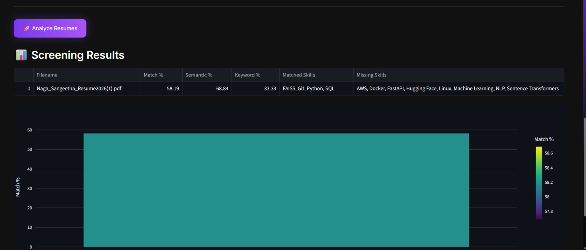
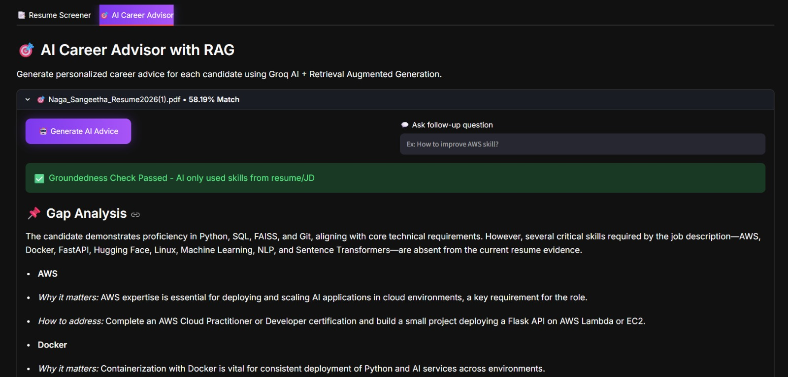
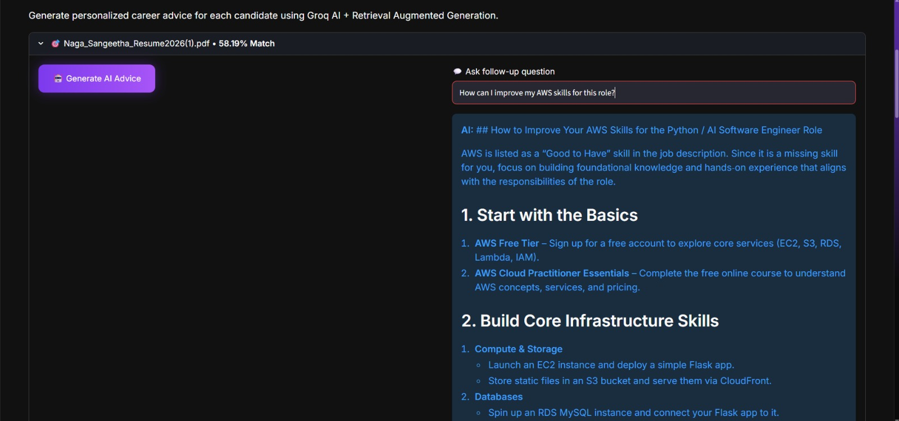

# ResumeIQ Pro

**Resume screening and AI career advice with Python, Streamlit, FastAPI and RAG.**

ResumeIQ compares PDF or DOCX resumes with a job description, ranks the results and generates contextual career advice.

[Setup](#run-locally) · [Team contributions](#team-contributions) · [Detailed technical and demo guide](docs/PROJECT_GUIDE.md)



## Features

- Resume text extraction from PDF and DOCX files.
- Semantic similarity with Sentence Transformers.
- Matched and missing skill identification.
- A fit score combining 70% semantic similarity and 30% keyword matching.
- FAISS retrieval of resume context for the AI Career Advisor.
- Skill-gap guidance, interview questions and three resume-improvement suggestions.
- Structured responses with Pydantic validation and skill-groundedness checks.
- Follow-up career chat, CSV export and FastAPI endpoints.

The score is a project-specific matching heuristic, not a hiring probability or a universal ATS score. When no known skills are found in the job description, the scoring module uses the semantic score for both components.

## Technology

| Area | Tools |
| --- | --- |
| Language | Python 3.12 |
| Interface and API | Streamlit, FastAPI |
| Embeddings and retrieval | Sentence Transformers, `all-MiniLM-L6-v2`, FAISS |
| Generation | Groq API |
| Parsing and data | PyMuPDF, python-docx, Pandas, NumPy |
| Validation and charts | Pydantic, Plotly |

## Team contributions

| Team member | Primary responsibility | Main source |
| --- | --- | --- |
| **Sangeetha** | Generative AI, RAG and AI Career Advisor | [src/rag_assistant.py](src/rag_assistant.py) |
| **Deekshith** | Resume processing, embeddings and FAISS | `src/parser.py`, `src/preprocess.py`, `src/embeddings.py`, `src/vector_index.py` |
| **Vidhyanjali** | ATS scoring, skill matching and FastAPI | `src/scoring.py`, `src/ats_score.py`, `src/skills_data.py`, `app/fastapi_app.py` |

Sangeetha's module covers resume-context retrieval, Groq integration, structured advice, groundedness checks and follow-up questions. The [detailed guide](docs/PROJECT_GUIDE.md) preserves the team's module breakdown and presentation walkthrough.

## Run locally

```bash
git clone https://github.com/sangeethareddy9/ResumeIQ-RAG.git
cd ResumeIQ-RAG
```

Create and activate a virtual environment.

**Windows Command Prompt**

```bat
py -3.12 -m venv .venv
.venv\Scripts\activate
```

**Linux / macOS**

```bash
python3 -m venv .venv
source .venv/bin/activate
```

Install dependencies:

```bash
python -m pip install -r requirements.txt
```

Create a local `.env` using [.env.example](.env.example), and set your own Groq API key:

```dotenv
GROQ_API_KEY=your_groq_api_key
```

Keep the real key out of Git. The first embedding-model load requires an internet download; generated career advice requires Groq access.

### Streamlit interface

```bash
python -m streamlit run app/streamlit_app.py
```

Open `http://localhost:8501`, provide a job description and upload resumes. Run screening, then open the AI Career Advisor.

### FastAPI interface

```bash
python -m uvicorn app.fastapi_app:app --reload --port 8000
```

Open `http://127.0.0.1:8000/docs`.

| Endpoint | Purpose |
| --- | --- |
| `POST /screen` | Screen resumes and cache their parsed text |
| `POST /advise` | Generate advice for a previously screened resume |

Call `/screen` first, then `/advise` with the same filename and job description in the same server session. Restarting the server clears the in-memory cache.

## Screenshots

### Career advisor



### Follow-up chat



[Home screen](assets/home.png) · [API response screenshot](assets/api_advise.png)

## Current scope

This is an educational team project. OCR for scanned resumes, persistent resume caching and recruiter authentication are not implemented. Groundedness checks reduce unsupported skill claims but do not guarantee that all generated advice is correct.

## More detail

Read the [technical and demo guide](docs/PROJECT_GUIDE.md) for prompting, retrieval, API examples, module responsibilities and planned enhancements.
